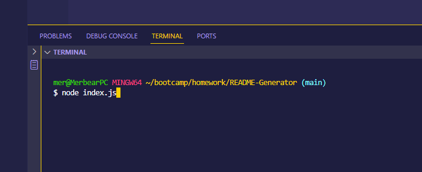

# README Generator

## Description
The goal of this README Generator is to demonstrate what I have learned about nodeJS by building an application that allows the end user to easily build a README file by answering a few prompted questions.

### Specific Objectives:
1.  A command-line application that accepts user input
2.  I am prompted for information about my application repository and a high-quality, professional README.md is generated with the title of my project and sections entitled Description, Table of Contents, Installation, Usage, License, Contributing, Tests, and Questions
3. I enter my project title and this is displayed as the title of the README
4. I enter a description, installation instructions, usage information, contribution guidelines, and test instructions and this information is added to the sections of the README entitled Description, Installation, Usage, Contributing, and Tests
5. I choose a license for my application from a list of options and a badge for that license is added near the top of the README and a notice is added to the section of the README entitled License that explains which license the application is covered under
6.  I enter my GitHub username and this is added to the section of the README entitled Questions, with a link to my GitHub profile
7. I enter my email address and this is added to the section of the README entitled Questions, with instructions on how to reach me with additional questions
8. I click on the links in the Table of Contents and I am taken to the corresponding section of the README

## Installation
Open a terminal inside the folder where you have downloaded the respository. In that command line, type: "node index.js"

## Screenshots
Opening a terminal within the correct folder:

Typing in "node index.js" to start the application on the command line:

Terminal view after running index.js and answering the prompts:

Final product using my answers:

## Walkthrough Video 
